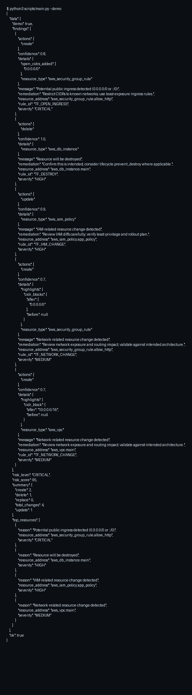

# Terraform Plan Risk Auditor

Analyze Terraform plan JSON (`terraform show -json plan.out`) for risky changes and blast radius.

## Overview

This skill inspects `resource_changes` and flags high-risk actions like destroys/replaces, IAM changes, and common public exposure patterns (open ingress CIDRs, public S3 ACLs) using deterministic heuristics.

## Features

- Detects **destroy** and **replace** operations
- Flags **IAM-related** resource changes
- Heuristics for **public ingress** (`0.0.0.0/0`, `::/0`) on security group / firewall resources
- Heuristics for **S3 public exposure** signals (ACL/flags)
- Deterministic ordering + `max_findings` limiting

## Use Cases

- PR gate on Terraform plan output
- CI “blast radius” report before apply
- Security review checklist for network/IAM changes

## Quickstart

```bash
# Demo
python3 scripts/main.py --demo

# From a saved plan
terraform show -json plan.out > plan.json
python3 scripts/main.py --params '{"plan_path":"plan.json"}'
```

## Parameters

| Name | Type | Required | Description |
|------|------|----------|-------------|
| `plan_json` | object | no | Parsed Terraform plan JSON object |
| `plan_json_text` | string | no | Raw JSON string of the plan |
| `plan_path` | string | no | Path to plan JSON file |
| `max_findings` | int | no | Maximum findings to return (default: 50) |
| `focus` | string | no | `security`, `cost`, or `all` (default: `all`) |

## Example Output (Short)

```json
{"ok":true,"data":{"demo":true,"findings":[{"rule_id":"TF_OPEN_INGRESS","severity":"CRITICAL"}]}}
```

## Demo Screenshot


