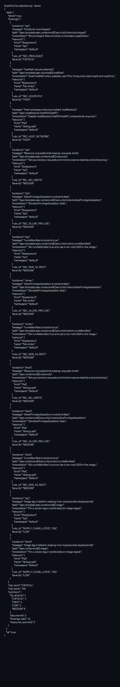

# Kubernetes Manifest Security Auditor

Static analysis for Kubernetes YAML manifests to catch common security and reliability risks (no cluster access required).

## Overview

This skill parses Kubernetes multi-document YAML and emits a deterministic JSON report with findings ranked by severity.

## Features

- Flags privileged containers
- Flags host namespace sharing (`hostNetwork`, `hostPID`, `hostIPC`)
- Flags `hostPath` volumes
- Flags missing `runAsNonRoot: true`
- Flags missing `allowPrivilegeEscalation: false`
- Flags missing resource requests/limits
- Flags `:latest` or missing image tags

## Quickstart

```bash
python3 -m pip install -r requirements.txt

# Demo
python3 scripts/main.py --demo

# Audit a file
python3 scripts/main.py --params '{"manifest_path":"./k8s.yaml","ruleset":"restricted"}'
```

## Parameters

| Name | Type | Required | Description |
|------|------|----------|-------------|
| `manifests_yaml` | string | no | Multi-doc YAML string |
| `manifest_path` | string | no | Path to a YAML file |
| `ruleset` | string | no | `baseline` or `restricted` (default: `baseline`) |
| `max_findings` | int | no | Maximum findings to return (default: 200) |

## Example Output (Short)

```json
{"ok":true,"data":{"risk_level":"CRITICAL","findings":[{"rule_id":"SEC_PRIVILEGED"}]}}
```

## Demo Screenshot


