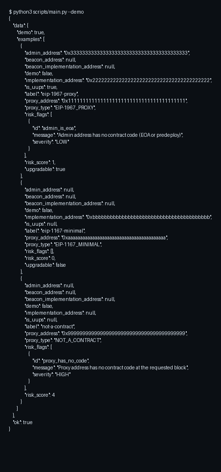

# EVM Proxy Upgrade Analyzer

Detect EVM proxy patterns (EIP-1967, Beacon, EIP-1167 minimal proxy) and report implementation/admin/beacon addresses with upgrade risk flags.

## Overview

This skill performs lightweight, deterministic checks against an RPC endpoint using JSON-RPC calls:
- `eth_getCode`
- `eth_getStorageAt`
- `eth_call`

Demo mode is fully offline.

## Features

- Detects EIP-1167 minimal proxy and extracts embedded implementation address
- Detects EIP-1967 proxy (implementation/admin slots)
- Detects EIP-1967 beacon proxy (beacon slot + optional beacon implementation lookup)
- Optional UUPS check via `proxiableUUID()`
- Emits structured `risk_flags` + `risk_score` (0-10)

## Quickstart

```bash
python3 -m pip install -r requirements.txt

# Demo (offline)
python3 scripts/main.py --demo

# Real analysis (requires an RPC URL)
python3 scripts/main.py --params '{"rpc_url":"https://YOUR_RPC","proxy_address":"0xYOUR_PROXY"}'
```

## Parameters

| Name | Type | Required | Description |
|------|------|----------|-------------|
| `rpc_url` | string | yes | JSON-RPC endpoint URL |
| `proxy_address` | string | yes | Proxy contract address (`0x` + 40 hex) |
| `block` | string/int | no | Block tag/number (default: `latest`) |
| `timeout_seconds` | int | no | HTTP timeout (default: 20) |
| `check_uups` | bool | no | Call `proxiableUUID()` on implementation (default: true) |
| `check_beacon_impl` | bool | no | Call `implementation()` on beacon (default: true) |

## Example Output (Short)

```json
{"ok":true,"data":{"proxy_type":"EIP-1967_PROXY","implementation_address":"0x...","risk_score":1}}
```

## Demo Screenshot


