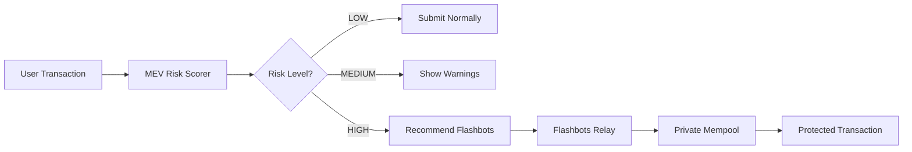

# MEV Protection Analyzer

> **Protect your DeFi transactions from MEV attacks (sandwich attacks, frontrunning) with real-time risk analysis and Flashbots integration.**

[](https://spoon.network)
[](https://docs.flashbots.net/)
[](https://www.python.org/downloads/)

## What is MEV?

**MEV (Maximal Extractable Value)** is profit extracted by reordering, inserting, or censoring transactions. Common attacks:

- **Sandwich Attacks**: Bot buys before your swap, sells after → you lose 1-5% of trade value
- **Frontrunning**: Bot copies your transaction with higher gas → executes first
- **Backrunning**: Bot arbitrages immediately after your transaction

**Real Cost**: Users lose **$50-$500 per transaction** to MEV bots on large swaps.

## Features

✅ **Real-time MEV Detection** - Simulate transactions before submission  
✅ **Sandwich Attack Analysis** - Detect frontrun/backrun patterns  
✅ **Risk Scoring** - 0-100 MEV risk score with explanations  
✅ **Flashbots Integration** - Submit transactions privately to avoid MEV  
✅ **Multi-chain Support** - Ethereum, Polygon, Arbitrum, Base, Optimism  
✅ **Actionable Recommendations** - Clear guidance on how to protect yourself

---

## Quick Start

### Installation

```bash
# Clone the repository
git clone https://github.com/XSpoonAi/spoon-awesome-skill.git
cd spoon-awesome-skill/web3-data-intelligence/mev-protection

# Install dependencies
pip install -r requirements.txt

# Set up environment variables
cp .env.example .env
# Edit .env with your API keys
```

### Environment Variables

```bash
# Required
ALCHEMY_API_KEY=your_alchemy_key
ETHERSCAN_API_KEY=your_etherscan_key

# Optional (for Flashbots protection)
FLASHBOTS_RELAY_URL=https://relay.flashbots.net
PRIVATE_KEY=0x...  # Only needed for transaction submission
```

---

## Usage Examples

### Example 1: Check MEV Risk Before Swap

**Scenario**: You want to swap 10 ETH for USDC on Uniswap

```python
from spoon_ai.agents import SpoonReactSkill
from spoon_ai.chat import ChatBot

agent = SpoonReactSkill(
    name="defi_agent",
    skill_paths=[".agent/skills"],
    scripts_enabled=True
)

result = await agent.run(
    "I want to swap 10 ETH for USDC on Uniswap. Check if it's safe from MEV attacks."
)
```

**Output**:
```
## MEV Risk Analysis

### Risk Assessment
**Overall Risk Score**: 75/100 (HIGH)

⚠️ **Sandwich Attack Risk**: HIGH
- Estimated loss: 0.32 ETH ($1,205)
- 3 known MEV bots monitoring this pool

### Recommendations
1. ✅ Use Flashbots Protect (saves ~$1,200)
2. ⚙️ Increase slippage tolerance to 1%
3. 📊 Split into 5x 2 ETH swaps

Would you like me to submit via Flashbots?
```

---

### Example 2: Analyze Historical Sandwich Attack

**Scenario**: Check if a past transaction was sandwiched

```bash
# Using CLI
echo '{
  "tx_hash": "0x1234...",
  "chain": "ethereum"
}' | python scripts/sandwich_detector.py
```

**Output**:
```json
{
  "is_sandwiched": true,
  "confidence": 0.95,
  "frontrun_tx": "0xabcd...",
  "backrun_tx": "0xef01...",
  "mev_bot_address": "0x...",
  "victim_loss": "0.045 ETH ($168.75)",
  "bot_profit": "0.042 ETH ($157.50)"
}
```

---

### Example 3: Submit Transaction via Flashbots

**Scenario**: Protect a high-value swap from MEV

```python
result = await agent.run(
    "Swap 50 ETH for USDC using Flashbots protection"
)
```

**Output**:
```
✅ Transaction submitted via Flashbots Protect

Bundle Hash: 0x789...
Status: Pending
Protection: Enabled
- No public mempool exposure
- No failed transaction fees
- MEV protection active

Estimated savings: $2,450 (avoided sandwich attack)
```

---

### Example 4: NFT Mint Frontrunning Analysis

**Scenario**: Check if your NFT mint will be frontrun

```bash
echo '{
  "tx_type": "nft_mint",
  "contract_address": "0x...",
  "chain": "ethereum",
  "gas_price": "50000000000"
}' | python scripts/frontrun_analyzer.py
```

**Output**:
```json
{
  "frontrun_risk": "HIGH",
  "risk_score": 85,
  "competing_txs": 12,
  "recommended_gas_price": "75000000000",
  "estimated_success_probability": 0.45,
  "risks": [
    "12 pending transactions targeting same mint",
    "Known MEV bots active in mempool"
  ]
}
```

---

## How It Works



### Detection Methods

1. **Transaction Simulation** (Alchemy/Tenderly)
   - Simulate transaction in current mempool state
   - Calculate price impact and slippage
   - Detect sandwich opportunities

2. **Mempool Analysis**
   - Monitor pending transactions
   - Identify MEV bot patterns
   - Detect frontrun/backrun sequences

3. **Historical Data**
   - Track MEV activity on target pools
   - Identify known MEV bot addresses
   - Calculate risk based on past attacks

4. **Risk Scoring**
   - Liquidity depth analysis
   - Gas price competition
   - Time-of-day patterns
   - Transaction size vs pool size

---

## Scripts Reference

| Script | Purpose | Input | Output |
|--------|---------|-------|--------|
| `mev_simulator.py` | Pre-transaction MEV simulation | Transaction data | Risk score + recommendations |
| `sandwich_detector.py` | Detect sandwich attacks | Transaction hash | Sandwich analysis |
| `frontrun_analyzer.py` | Analyze frontrunning risks | Transaction type + contract | Frontrun risk assessment |
| `mev_risk_scorer.py` | Calculate MEV risk score | Transaction data | Overall risk score |
| `wallet_analyzer.py` | Analyze wallet history | Wallet address | MEV history & recent risk |
| `flashbots_relay.py` | Submit via Flashbots | Transaction data | Bundle submission status |

### Script Usage

All scripts accept JSON input via stdin:

```bash
# MEV Simulator
echo '{"tx_data": {...}, "chain": "ethereum"}' | python scripts/mev_simulator.py

# Sandwich Detector
echo '{"tx_hash": "0x...", "chain": "ethereum"}' | python scripts/sandwich_detector.py

# Frontrun Analyzer
echo '{"tx_type": "nft_mint", "contract_address": "0x..."}' | python scripts/frontrun_analyzer.py

# MEV Risk Scorer
echo '{"tx_data": {...}, "chain": "ethereum"}' | python scripts/mev_risk_scorer.py

# Flashbots Relay
echo '{"tx_data": {...}, "max_priority_fee": "2000000000"}' | python scripts/flashbots_relay.py

# Wallet Analyzer
python scripts/wallet_analyzer.py 0x7E19... --limit 10
```

---

## Integration with SpoonOS

### SpoonReactSkill Agent

```python
from spoon_ai.agents import SpoonReactSkill
from spoon_ai.chat import ChatBot

class MEVProtectedAgent(SpoonReactSkill):
    def __init__(self, **kwargs):
        kwargs.setdefault('name', 'mev_protected_agent')
        kwargs.setdefault('skill_paths', ['.agent/skills'])
        kwargs.setdefault('scripts_enabled', True)
        super().__init__(**kwargs)

    async def initialize(self):
        await super().initialize()
        # Auto-activate MEV protection skill
        if "mev-protection" in self.list_skills():
            await self.activate_skill("mev-protection")

async def main():
    agent = MEVProtectedAgent(
        llm=ChatBot(llm_provider="openai", model_name="gpt-4o"),
        auto_trigger_skills=True
    )
    await agent.initialize()
    
    # Agent automatically uses MEV protection for swaps
    result = await agent.run(
        "Swap 5 ETH for USDC on Uniswap"
    )
    print(result)
```

---

## Chain Support

| Chain | MEV Risk | Flashbots | Status |
|-------|----------|-----------|--------|
| Ethereum | 🔴 Very High | ✅ Yes | Fully supported |
| Polygon | 🟡 Medium | ❌ No | Detection only |
| Arbitrum | 🟡 Medium | ❌ No | Detection only |
| Optimism | 🟡 Medium | ❌ No | Detection only |
| Base | 🟡 Medium | ❌ No | Detection only |

---

## Security Best Practices

### For Users

✅ **Always check MEV risk** before large swaps (>$10,000)  
✅ **Use Flashbots** for high-value transactions on Ethereum  
✅ **Set appropriate slippage** (0.5-1% for most swaps)  
✅ **Avoid peak hours** (high gas = more MEV activity)  
✅ **Monitor transaction status** after submission  

❌ **Never share private keys** with anyone  
❌ **Don't ignore high risk warnings**  
❌ **Don't use excessive slippage** (makes you a target)

### For Developers

✅ **Use read-only simulation** when possible  
✅ **Rate limit API calls** to avoid bans  
✅ **Cache historical data** to reduce API usage  
✅ **Implement fallbacks** for API failures  
✅ **Log errors, not sensitive data**

---

## API Requirements

| Service | Purpose | Free Tier | Required |
|---------|---------|-----------|----------|
| [Alchemy](https://alchemy.com) | Transaction simulation | 300M CU/month | Yes |
| [Etherscan](https://etherscan.io/apis) | Historical data | 100k calls/day | Yes |
| [Flashbots](https://docs.flashbots.net/) | Private transactions | Unlimited | Optional |
| [Tenderly](https://tenderly.co) | Advanced simulation | 50 sims/month | Optional |

---

## Troubleshooting

### "Simulation failed"
**Cause**: Invalid transaction data or insufficient gas  
**Solution**: Check transaction parameters, increase gas limit

### "Flashbots submission failed"
**Cause**: Invalid signature or network issues  
**Solution**: Verify `PRIVATE_KEY` is set, check Flashbots status

### "High risk score but no specific threats"
**Cause**: Multiple moderate risk factors  
**Solution**: Review individual factors, use Flashbots as precaution

### "API rate limit exceeded"
**Cause**: Too many requests to Alchemy/Etherscan  
**Solution**: Implement caching, reduce request frequency

---

## Contributing

We welcome contributions! See [CONTRIBUTING.md](../../CONTRIBUTING.md) for guidelines.

### Development Setup

```bash
# Install dev dependencies
pip install -r requirements-dev.txt

# Run tests
pytest tests/ -v

# Run linter
flake8 scripts/
black scripts/
```

---

## License

MIT License - see [LICENSE](../../LICENSE) for details

---

## Acknowledgments

- [Flashbots](https://flashbots.net) - MEV protection infrastructure
- [Alchemy](https://alchemy.com) - Transaction simulation API
- [SpoonOS](https://spoon.network) - AI agent platform

---

## Support

- **Documentation**: [SKILL.md](./SKILL.md)
- **Issues**: [GitHub Issues](https://github.com/XSpoonAi/spoon-awesome-skill/issues)

---

**⚠️ Disclaimer**: This tool provides risk analysis but cannot guarantee complete MEV protection. Always verify transaction details before signing. Use at your own risk.
